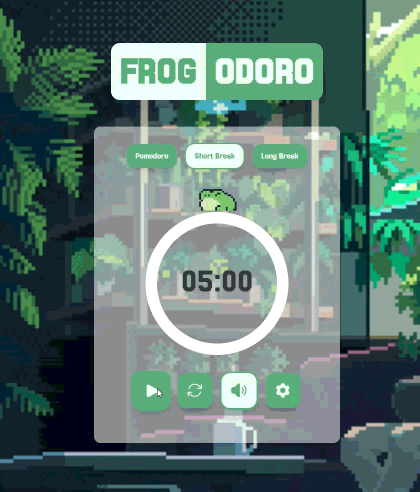
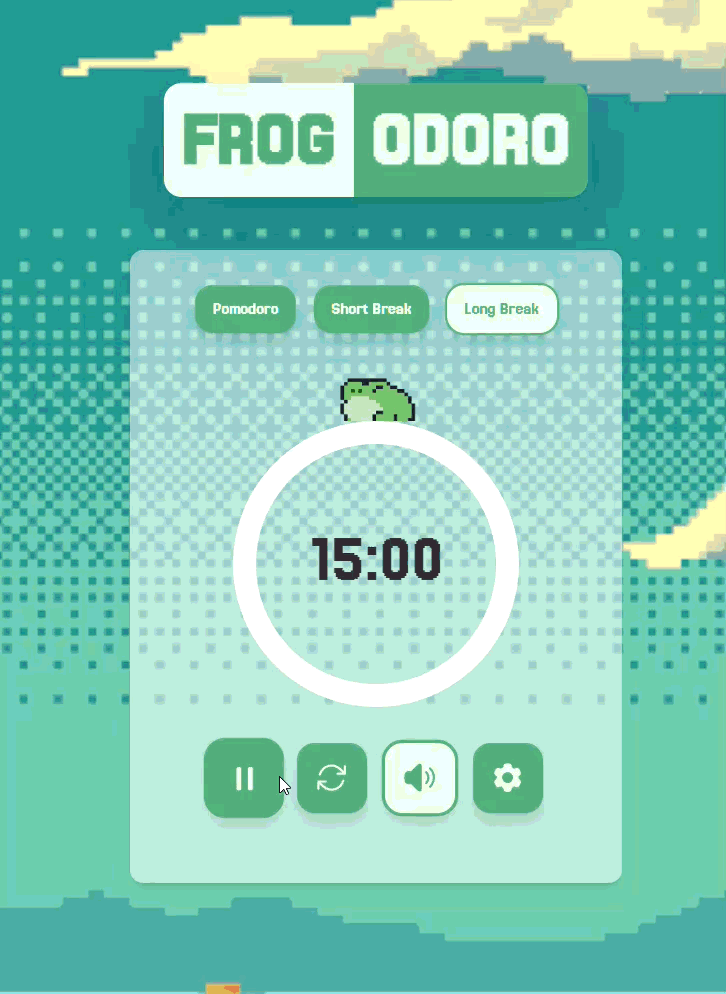
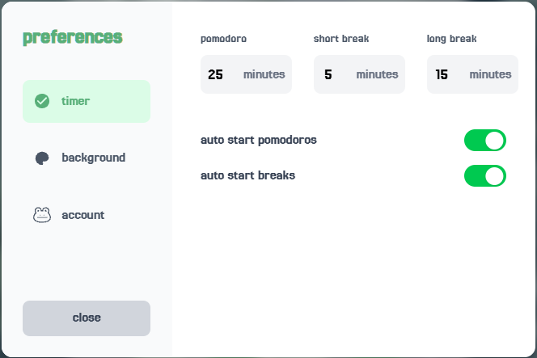

<div align="center">


# Frogodoro

A cozy, frog-themed Pomodoro timer for focused work and mindful breaks.

<!-- Optional badges once CI is stable — uncomment and fill in the repo path
[](https://github.com/NGHades/frogodoro/actions/workflows/ci.yml)
-->

[](https://react.dev)
[](https://vite.dev)
[](https://tailwindcss.com)
[](https://firebase.google.com)

</div>


## About

**Frogodoro** is a [Pomodoro Technique](https://en.wikipedia.org/wiki/Pomodoro_Technique) timer that pairs focused work sessions with a friendly hopping frog, lo-fi background music, and a handful of relaxing scenes to work in front of. Work in focused bursts, take short and long breaks, and (optionally) sign in to track your stats across sessions.

## Features

- **Pomodoro timer** — configurable focus, short break, and long break durations
- **Animated frog companion** — idles and hops along as your session runs
- **Lo-fi background music** — separate tracks for focus and break modes, with mute control
- **Selectable backgrounds** — river landscape, koi pond, vivarium, sunset lake, waterfall, and desert scenes
- **Auto-start** — optionally auto-start the next break or pomodoro when a session ends
- **Account sync (Firebase)** — sign up / log in to save your settings and background choice across devices
- **Stats tracking** — sessions completed, total focus minutes, current streak, and longest streak
- **Local persistence** — timer settings and background persist via `localStorage` even when signed out








## Tech Stack

| Layer              | Technology                                                                 |
| ------------------ | --------------------------------------------------------------------------- |
| Framework           | [React 19](https://react.dev) (with the React Compiler)                    |
| Build tool          | [Vite 7](https://vite.dev)                                                  |
| Styling             | [Tailwind CSS 4](https://tailwindcss.com)                                   |
| Timer UI            | [react-circular-progressbar](https://www.npmjs.com/package/react-circular-progressbar) |
| Audio               | [use-sound](https://www.npmjs.com/package/use-sound)                        |
| Auth & data         | [Firebase](https://firebase.google.com) (Authentication + Firestore)        |
| Linting             | ESLint 9                                                                     |
| CI                  | GitHub Actions (lint + build on push/PR to `main`) with Dependabot          |

## Getting Started

### Prerequisites

- [Node.js](https://nodejs.org/) 20 or later
- npm (bundled with Node.js)
- A [Firebase](https://firebase.google.com/) project, if you want account sync and stats to work

### Installation

```bash
git clone https://github.com/NGHades/frogodoro.git
cd frogodoro
npm install
```

### Firebase configuration

Frogodoro uses Firebase for authentication and storing user settings/stats. Create a `.env` file in the project root (or configure `src/components/firebaseConfig.js` directly) with your Firebase project credentials:

```bash
VITE_FIREBASE_API_KEY=your_api_key
VITE_FIREBASE_AUTH_DOMAIN=your_project.firebaseapp.com
VITE_FIREBASE_PROJECT_ID=your_project_id
VITE_FIREBASE_STORAGE_BUCKET=your_project.appspot.com
VITE_FIREBASE_MESSAGING_SENDER_ID=your_sender_id
VITE_FIREBASE_APP_ID=your_app_id
```

> The app still works without Firebase configured — the timer and background selection just fall back to `localStorage`, and account/stats features will be unavailable.

### Run the dev server

```bash
npm run dev
```

Then open the printed local URL (typically `http://localhost:5173`) in your browser.

### Other scripts

```bash
npm run build     # Production build to dist/
npm run preview   # Preview the production build locally
npm run lint      # Run ESLint
```

## Project Structure

```
frogodoro/
├── public/                 # Static assets (favicon, etc.)
├── src/
│   ├── assets/              # Backgrounds, frog sprites, and music
│   ├── components/          # Timer, Settings, buttons, auth UI, Firebase config
│   ├── context/              # Auth and background React contexts
│   ├── services/              # Firestore read/write helpers
│   ├── App.jsx                # App shell, background picker, marketing sections
│   └── main.jsx                # Entry point
└── vite.config.js
```

## Roadmap

See [tasks.md](tasks.md) for in-progress and planned work, including:

- [ ] Spotify player integration
- [ ] Additional auth improvements

## Acknowledgements

- Inspired by [Pomotroid](https://github.com/splode/pomotroid)
- Frog sprites: "Casual Frog Traveler" and "Toxic Frog" asset packs

## License

No license has been specified for this project yet.
